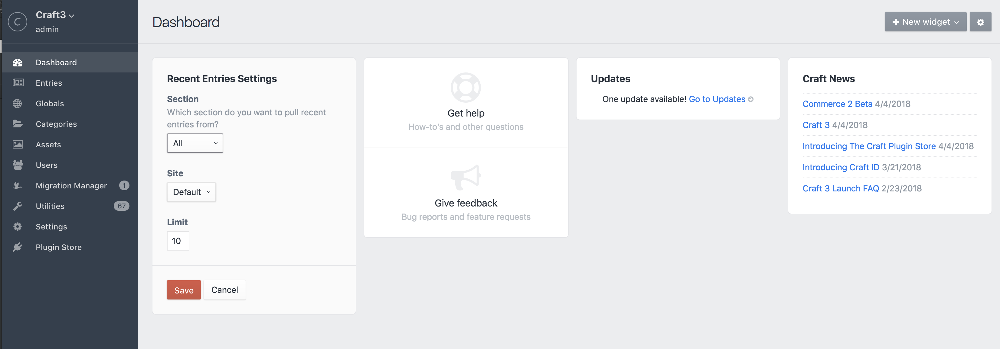

# Migration Manager for [Craft CMS](https://craftcms.com/)

Create migrations to easily move settings and content between CraftCMS website installations with the click of a mouse, no coding required. You can select which elements to migrate and create a native Craft content migration file that can be committed to your version control system. The migration(s) can then be applied on different CraftCMS installations to instantly create and update settings and content, without needing to enter data multiple times. By using migrations you can ensure your various website environments (local, staging, production, etc.) stay in sync and up to date.

## Installation
You can install MigrationManager via the Plugin Store in the Craft AdminCP.

## Use
The Migration Manager can create migrations for the following tasks:

- adding and updating:
  - fields
  - sections and entry types
  - categories
  - asset volumes and transformations
  - user groups
  - sites and locales
  - tags
  - routes
  - email settings
- adding and updating content:
  - entries
  - categories
  - globals
  - users

To create a migration select the elements you wish to migrate and then click the 'Create Migration' button at the bottom of the page.


A migration file will be created in the `craft/migrations` folder. The migration filename will contain the slugs/handles of the migrated items. Move the new migration file to your destination environment, ideally with version control.

- In your development environment:

```terminal
git add .
git commit -am 'new migration'
git push
```

- In your destination environment:

```terminal
git pull
```

When new migration(s) are in your destination environment a badge will appear to let you know. Click on the 'Migrations' tab and run the new migrations. You can run all the pending migrations by simply clicking the Run Migrations button or you can select individual migrations to run. You can also run migrations from the native Craft/Utilities/Migrations tab (but this only allows you to run all pending migrations).



The MigrationManager uses Craft's built in migrator to run migrations. Failed migrations will be rolled back and the database will be returned to it's pre migration state. You can check both the Craft logs to see details on why the migration failed. In many instances it's simply a case of a migration having dependencies (ie required fields) that have not been setup on the destination site or a missing plugin.

You can also view previously applied migrations by clicking the 'Applied' tab on the MigrationManager/Migrations page. This will show you migrations that have already been applied and migrations that were created locally (and don't need to be run locally). Note that if you create [blank migrations](#custom-migrations) (by clicking the Create Migration button without selecting elements) they will show up in the New Migrations list, so that you have a chance to test and run them locally with your custom migration code.

## Field type support
Migration manager currently supports all core CraftCMS fields types:

- Assets
- Categories
- Checkboxes
- Color
- Date/Time
- Dropdown
- Entries
- Lightswitch
- Matrix
- Multi-select
- Number
- Plain Text
- Radio Buttons
- Rich Text
- Table
- Tags
- Url
- Users

In addition it also supports:
- [SuperTable](https://github.com/engram-design/SuperTable)
- stay tuned - [Neo](https://github.com/benjamminf/craft-neo)

To support additional field types and special content you can use event handlers for customized import/export functions. There are two distinct types of export/import procedures you need to consider when adding custom support. Exporting/importing element settings and exporting/importing element content.

To handle export/import of custom field types your plugin/module should listen for the Export/Import events that are triggered from elements that utilize fields. Following is the list of elements that the Migration Manager has events for that allow you to modify the export/import data to support custom fields.

### Settings
- AssetSource
- AssetTransform (only after import)
- Categories
- Fields
- Globals
- Sections
- Sites
- Tags
- UserGroups

You can also listen for export/import events on pure content migrations to modify data or perform additional actions as part of a migration. 

### Content
- Entries
- Categories
- Globals
- Users

### Using events
During the export event you can modify the $event->value data to include any additional settings not already in the data to be exported.
```php
//Custom field example
Event::on(Fields::class, Fields::EVENT_BEFORE_EXPORT_ELEMENT, function(ExportEvent $event) {
    $value = $event->value;
    $value['typesettings']['special_setting'] = 'some special setting value';
    $event->value = $value;
});
```

During the import you can modify the data before it is imported or deal with the element after it has been imported and either created or updated.

Before import, the $event->element is the element model (based on handle match) to be imported (updated or created). The $event->value property is the raw data used to populate the element model. Change properties in the $event->element to modify the element before it is saved. 
```php
//Custom fields
Event::on(Fields::class, Fields::EVENT_BEFORE_IMPORT_ELEMENT, function(ExportEvent $event) {
   $element = $event->element;
   $element->special_setting = $event->value['settings']['special_setting'];
   $event->element = $element;
});
```

After import you can access the $event->element and $event->value to perform additional operations related to the element if needed.
```php
Event::on(Fields::class, Fields::EVENT_AFTER_IMPORT_ELEMENT, function(ExportEvent $event) {
   $event->value['typesettings']['special_setting'] = 'some special setting value';
});
```

You can also cancel an import if needed and provide an error message. Error messages will be written to the Craft web log.
```php
//Custom fields
Event::on(Fields::class, Fields::EVENT_BEFORE_IMPORT_ELEMENT, function(ExportEvent $event) {
    $event->isValid = false;
    $event->error = 'my reason for cancelling';
});
```

Any values in the field data that contains id's should be converted to handles/slug or some string based value that can be looked up on the destination site without depending on matching id values as id values can differ between website database instances.

For importing custom fields the imported value should match the fields required input structure. Check the field type's documentation and code for help on determining the correct structure.

## Content migrations

With migrations you also have the ability to create content migrations directly from element index pages (ie the entry, category and user list pages). Select the entries you wish to export and then click the 'create migration' option in the action list. Content migrations are dependent on a workflow where you migrate related/dependent elements first. For example, if you have an entry that has some selected categories, the categories need exist on the destination site before the entry migration will work correctly. This means creating a migration of the category(ies) first. This holds true for users, assets other other entries. In the case of assets you will need to ensure the matching asset (based on asset source/folder/filename) exists on the destination site. For Global values, use the 'Create Migration' button on the global screen.

 

## Custom migrations

In addition to generated migrations you can use the MigrationManger to create empty migrations that can be used for tasks like deleting fields and creating content. To create an empty migration simply click the 'Create Migration' on the Migration Manager/Create Migrations tab. A new empty migration will be added to the `craft/migrations` folder.

View the [examples](EXAMPLES.md).


#### Credits

The entire dev team at [Firstborn](https://www.firstborn.com/)

Flying Duck icon by Agne Alesiute from the [Noun Project](https://thenounproject.com/)
