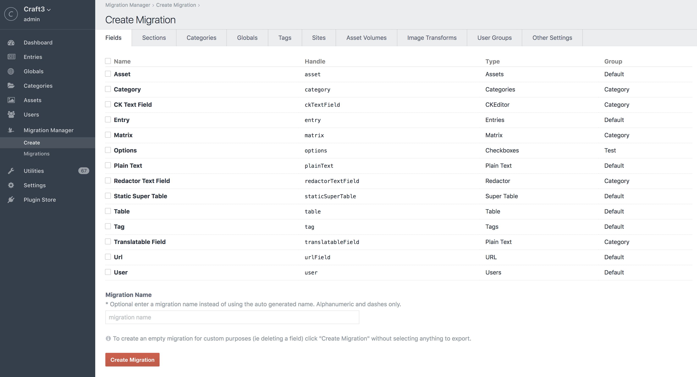

# Migration Manager for [Craft CMS](https://craftcms.com/)

Create migrations to easily move settings and content between CraftCMS website installations. You can select which elements to migrate and create a migration file that can be committed to your version control system. The migration(s) can then be applied on different CraftCMS installations to instantly create and update settings and content, without needing to enter data multiple times. By using migrations you can ensure your various website environments (local, staging, production, etc.) stay in sync and up to date.

## Installation
1. Move the `migrationmanager` directory into your `craft/plugins` directory.
2. Go to Settings &gt; Plugins from your Craft control panel and enable the `Migration Manager` plugin

## Use
The Migration Manager can create migrations for the following tasks:
- adding and updating:
    - fields
    - sections and entry types
    - categories
    - asset sources and transformations
    - user groups
    - locales
    - tags
    - routes
    - email settings
- adding and updating content:
    - entries
    - categories
    - globals
    - users

To create a migration select the elements you wish to migrate and then click the 'Create Migration' button at the bottom of the page.



A migration file will be created in the `craft/plugins/migrationmanager/migrations/generated` folder. The migration filename will contain the slugs/handles of the migrated items. Move the new migration file to your destination environment, ideally with version control.

- In your development environment:   
```
 git add .
 git commit -am 'new migration'
 git push
```
- In your destination environment:
 ```
 git pull
 ```

Once the migration(s) are in your destination environment, go to the Migration Manager panel in your destination environment, click on the 'Migrations' tab and run the new migrations.
 
 
 
Before executing the migration(s) the Craft database will be backed up and stored in the backups directory. To disable backups from being created each time a migration is run you can set the `backupDbOnUpdate` config setting to false (https://craftcms.com/docs/config-settings#backupDbOnUpdate). **This is not recommended**.

If a migration fails to execute the migration will be rolled back and the database will be restored to state before the migration started. You can check the Log tab to review previous migrations and see any error messages.

## Field type support
Migration manager currently supports all core CraftCMS fields types:
- Assets
- Categories
- Checkboxes
- Color
- Date/Time
- Dropdown
- Entries
- Lightswitch
- Matrix
- Multi-select
- Number
- Plain Text
- Position Select
- Radio Buttons
- Rich Text
- Table
- Tags
- Users

In addition it also supports:
- [SuperTable](https://github.com/engram-design/SuperTable)
 
To support additional field types you can use event handlers for customized import/export functions.

To import/export field settings for custom field types use:
- migrationManager_fields.exportField
- migrationManager_fields.importField

To export content field values for custom field types use (ideal for complex fieldtype data structures).
- migrationManager_fields.exportFieldContent


Any values in the field data that contains id's should be converted to handles/slug or some string based value that can be looked up on the destination site without depending on matching id values as id values can differ between website database instances.

For importing custom fields the imported value should match the fields required input structure. Check the field type's fieldtypes/[type] `prepValueFromPost` and `prepValue` methods for help on determining the correct structure.

When using events to modify the import/export of a field be sure to set `$event->performAction = false;` to prevent the default field action from happening. The value you want to be exported/imported must be assigned to the `$event->params['value']` variable.

```
craft()->on('migrationManager_entries.exportField', function(Event $event){
    $event->params['value'] = 'my value';
    $event->performAction = false;
});
```

This is an example of a custom plugin that listens for the 'migrationManager_fields.exportField' and 'migrationManager_fields.importField' and 'migrationManager_fields.exportFieldContent' events and then modifies the settings source values for a FruitLinkIt field.
```
public function init()
{

    craft()->on('migrationManager_fields.exportField', function(Event $event){
        if ($event->params['field']['type'] == 'FruitLinkIt')
        {
            //replace source ids with handles
            foreach ($event->params['value']['typesettings']['entrySources'] as $key => $value) {
                $section = craft()->sections->getSectionById(intval(substr($value, 8)));
                if ($section) {
                     $event->params['value']['typesettings']['entrySources'][$key] = $section->handle;
                }
            }

            foreach ($event->params['value']['typesettings']['categorySources'] as $key => $value) {
                if (substr($value, 0, 6) == 'group:') {
                    $categories = craft()->categories->getAllGroupIds();
                    $categoryId = intval(substr($value, 6));
                    if (in_array($categoryId, $categories)) {
                        $category = craft()->categories->getGroupById($categoryId);
                        if ($category) {
                            $event->params['value']['typesettings']['categorySources'][$key] = $category->handle;
                        }
                    }
                }
            }

            foreach ($event->params['value']['typesettings']['assetSources'] as $key => $value) {
                if (substr($value, 0, 7) == 'folder:') {
                    $source = craft()->assetSources->getSourceById(intval(substr($value, 7)));
                    if ($source) {
                        $event->params['value']['typesettings']['assetSources'][$key] = $source->handle;
                    }
                }
            }
        }
    });

    craft()->on('migrationManager_fields.importField', function(Event $event){
        if ($event->params['value']['type'] == 'FruitLinkIt')
        {
            //replace source handles with ids
            if (is_array($event->params['value']['typesettings']['entrySources'])) {
                $entrySources = [];
                foreach ($event->params['value']['typesettings']['entrySources'] as $value) {
                    $source = craft()->sections->getSectionByHandle($value);
                    if ($source) {
                        $entrySources[] = 'section:' . $source->id;
                    } elseif ($value == 'singles') {
                        $entrySources[] = $value;
                    }
                }
                $event->params['value']['typesettings']['entrySources'] = $entrySources;
            }

            if (is_array($event->params['value']['typesettings']['categorySources'])) {
                $categorySources = [];
                foreach ($event->params['value']['typesettings']['categorySources'] as $value) {

                    $source = craft()->categories->getGroupByHandle($value);
                    if ($source) {
                        $categorySources[] = 'group:' . $source->id;
                    }
                }
                $event->params['value']['typesettings']['categorySources'] = $categorySources;
            }

            if(is_array($event->params['value']['typesettings']['assetSources'])) {
                $assetSources = [];
                foreach ($event->params['value']['typesettings']['assetSources'] as $value) {
                    $source = MigrationManagerHelper::getAssetSourceByHandle($value);
                    if ($source) {
                        $assetSources[] = 'folder:' . $source->id;
                    }
                }
                $event->params['value']['typesettings']['assetSources'] = $assetSources;
            }

        }
    });
    
    craft()->on('migrationManager_fields.exportFieldContent', function(Event $event){
        if ($event->params['field']['type'] == 'FruitLinkIt') {
            //format value to expected LinkIt structure 
            if ($event->params['value'] != '') {
                $value = array(
                    'type' => $event->params['value']['type'],
                    'value' => $event->params['value']['value'],
                    'defaultText' => $event->params['value']['defaultText'],
                    'customText' => $event->params['value']['customText'],
                    'target' => $event->params['value']['target'],
                    $event->params['value']['type'] => $event->params['value']['value']
                );
                $event->params['value'] = $value;
            }
            $event->performAction = false;
    
        }
     });
}

```


## Custom migrations
In addition to generated migrations you can use the MigrationManger to create empty migrations that can be used for tasks like deleting fields and creating content. To create an empty migration simply click the 'Create Migration' on the Migration Manager/Create Migrations tab. A new empty migration will be added to the `craft/plugins/migrationmanager/migrations/generated` folder.

View the [examples](EXAMPLES.md).

## Content migrations
With migrations you also have the ability to create content migrations directly from element index pages (ie the entry, category and user list pages). Check the entries you wish to export and then click the 'create migration' option in the action list. Content migrations are dependent on a workflow where you migrate related/dependent elements first. For example, if you have an entry that has some selected categories, the categories need exist on the destination site before the entry migration will work correctly. This means creating a migration of the category(ies) first. This holds true for users, assets other other entries. In the case of assets you will need to ensure the matching asset (based on asset source/folder/filename) exists on the destination site. For Global values, use the 'Create Migration' button on the global screen.

 
 
 ## Handling Errors
 The MigrationManager will do a full database rollback if an error occurs during a migration. You can check both the migrationmanager.log and craft.log to see details on why the migration failed. In many instances it's simply a case of a migration having dependencies (ie required fields) that have not been setup on the destination site or a missing plugin.
 
 If after running a migration you attempt to edit an element (entry/category) and see an illegal offset error you need to edit the settings for the element that was updated via a migration (ie field). Simply find the field in the Settings/Fields section, open it and then click save. This is most often caused by a missing reference to a category/entry type for a category or entry selector field. Also make sure the reference element type exists.
 

##### Credits
The entire dev team at [Firstborn](https://www.firstborn.com/)


Flying Duck icon by Agne Alesiute from the [Noun Project](https://thenounproject.com/)